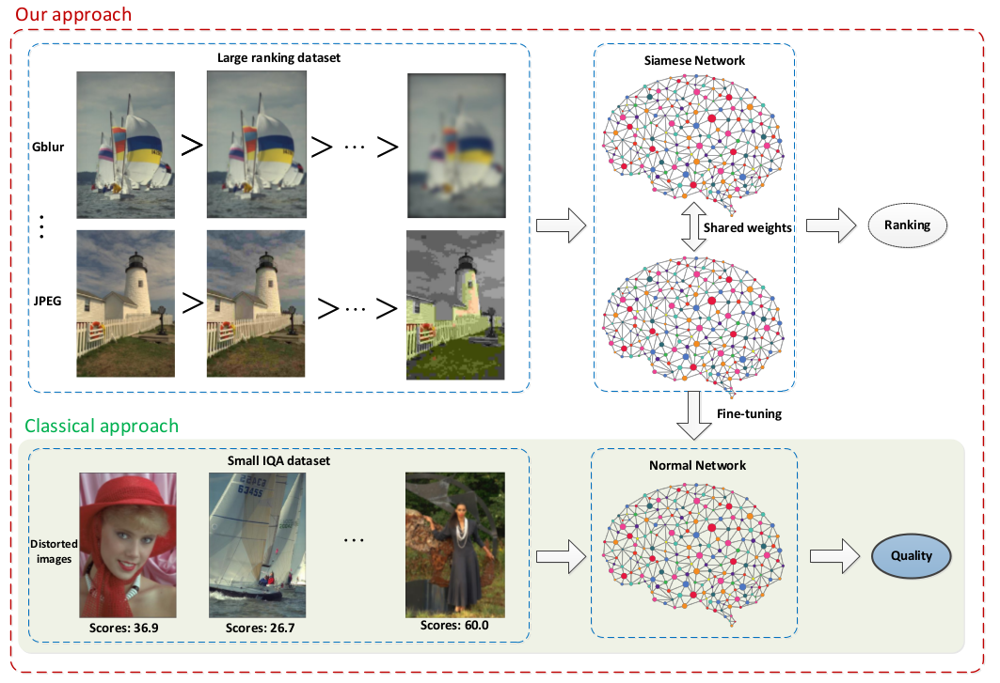

# RankIQA: Learning from Rankings for No-reference Image Quality Assessment

The paper will appear in ICCV 2017. An [arXiv pre-print](https://arxiv.org/abs/1707.08347) version and the [supplementary material](./pdf/Xialei_IQA_ICCV.pdf) are available.

## Authors

Xialei Liu, Joost van de Weijer and Andrew D. Bagdanov

## Institutions

[Computer Vision Center, Barcelona, Spain](http://www.cvc.uab.es/lamp/)

Media Integration and Communication Center, University of Florence, Florence, Italy

## Abstract

We propose a no-reference image quality assessment
  (NR-IQA) approach that learns from rankings 
  (RankIQA). To address the problem of limited IQA dataset size, we
  train a Siamese Network to rank images in terms of image quality by
  using synthetically generated distortions for which relative image
  quality is known. These ranked image sets can be automatically
  generated without laborious human labeling. We then use
  fine-tuning to transfer the knowledge represented in the trained
  Siamese Network to a traditional CNN that estimates absolute image
  quality from single images. We demonstrate how our approach can be
  made significantly more efficient than traditional Siamese Networks
  by forward propagating a batch of images through a single network
  and backpropagating gradients derived from all pairs of images in
  the batch. Experiments on the TID2013 benchmark show that we improve the state-of-the-art by over 5%. Furthermore, on the LIVE benchmark we show that our approach is superior to existing NR-IQA techniques and that we even outperform the state-of-the-art in full-reference IQA (FR-IQA) methods without having to resort to high-quality reference images to infer IQA.

## Models

The main idea of our approach is to address the problem of limited IQA dataset size, which allows us to train a much deeper CNN without overfitting.

## Framework

All training and testing are done in [Caffe](http://caffe.berkeleyvision.org/) framework.

## Datasets

### Ranking datasets

Using an arbitrary set of images, we synthetically generate deformations of these images over a range of distortion intensities. In this paper, the reference images in [Waterloo](https://ece.uwaterloo.ca/~zduanmu/cvpr16_gmad/) and the validation set of the [Places2](http://places2.csail.mit.edu/) are used as reference images. The details of generated distortions can be found in [supplementary material](./pdf/Xialei_IQA_ICCV.pdf).

### IQA datasets

We have reported experimental results on different IQA datasets including [TID2013](http://www.ponomarenko.info/tid2013.htm), [LIVE](http://live.ece.utexas.edu/research/quality/subjective.htm), [CSIQ](http://vision.eng.shizuoka.ac.jp/mod/page/view.php?id=23), [MLIVE](http://live.ece.utexas.edu/research/quality/live_multidistortedimage.html).

## Training

The details can be found in [src](./src).

### RankIQA

Using the set of ranked images, we train a Siamese network and demonstrate how our approach can be made
significantly more efficient than traditional Siamese Networks by forward propagating a batch of images through
a single network and backpropagating gradients derived from all pairs of images in the batch. The result is a
Siamese network that ranks images by image quality.

### RankIQA+FT

Finally, we extract a single branch of the Siamese network (we are interested at this point in the representation learned in the network, and not in the ranking itself), and fine-tune it on available IQA data. This effectively calibrates the network to output IQA measurements.

## Citation

Please cite our paper if you are inspired by the idea.
